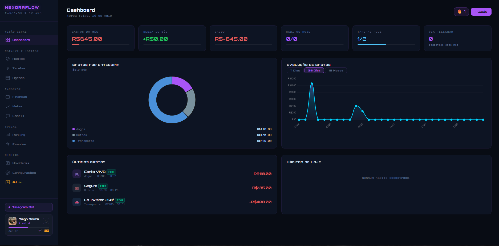
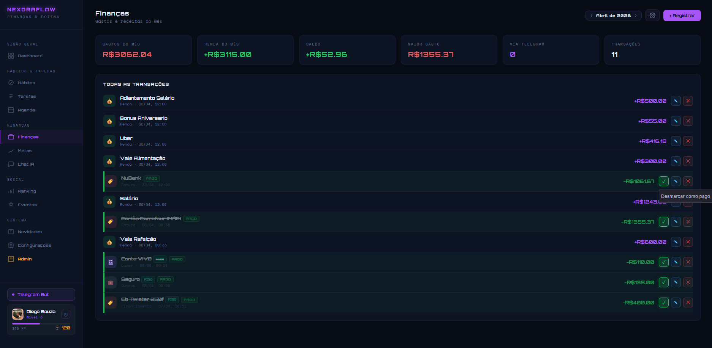
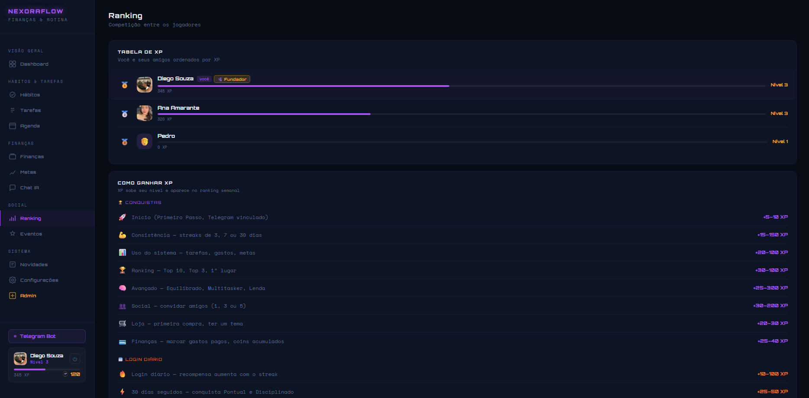
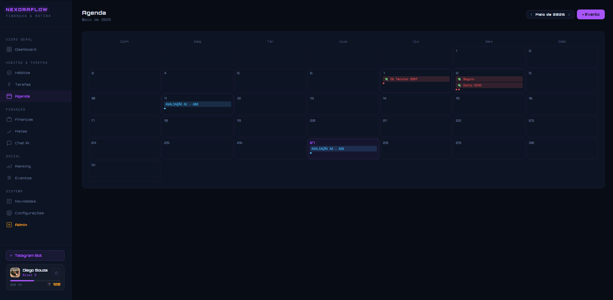
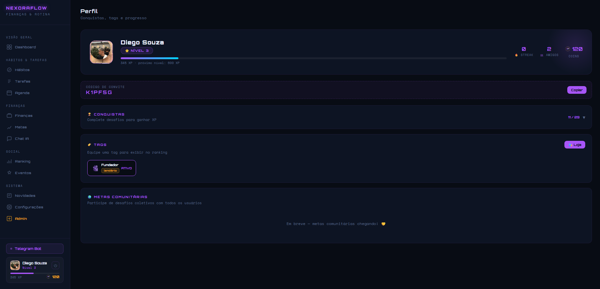
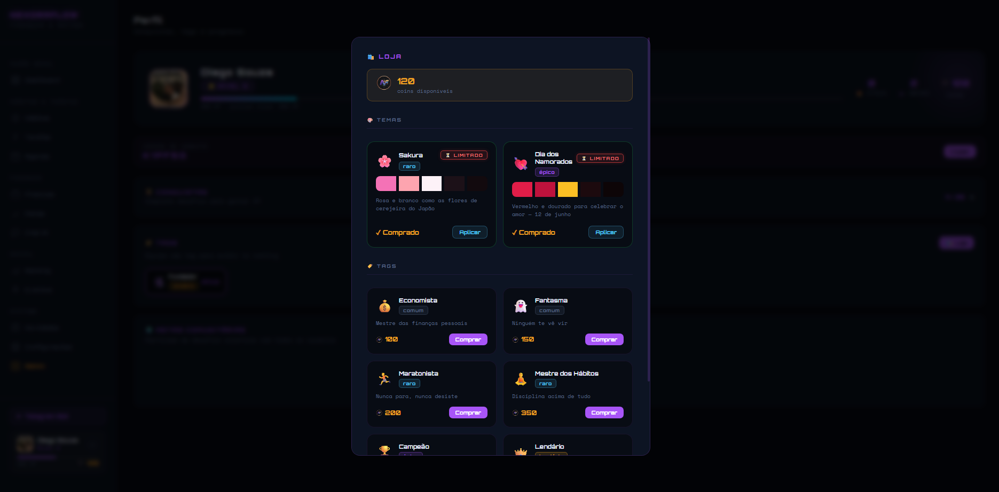

# NexoraFlow

> **Finanças & Rotina — tudo em um só lugar.**  
> Aplicação web fullstack para controle financeiro pessoal, tracking de hábitos, tarefas, gamificação e integração com IA e Telegram.

🔗 **Demo ao vivo:** [nexoraflow-xbh6.onrender.com](https://nexoraflow-xbh6.onrender.com)

---

## 📸 Screenshots

| Dashboard | Finanças | Ranking |
|-----------|----------|---------|
|  |  |  |

| Agenda | Perfil & Tags | Loja |
|--------|--------------|------|
|  |  |  |

---

## ✨ Funcionalidades

### 💰 Finanças
- Registro de gastos com categorias, parcelamento automático e tags de status
- Metas financeiras com barra de progresso
- Gráficos de evolução (7 dias / 30 dias / 12 meses) via Chart.js
- Resumo mensal com saldo, maior gasto e total de transações

### ✅ Hábitos & Tarefas
- Tracking de hábitos diários com grid visual
- Tarefas com datas limite e prioridades
- Agenda mensal com eventos por categoria

### 🤖 Assistente IA (NEXO)
- Chat em linguagem natural com Google Gemini Flash
- Detecta intenção e executa ações: registrar gasto, criar tarefa, marcar hábito
- Totalmente em português

### 📱 Bot Telegram
- Registro de gastos por mensagem: *"gastei 50 no almoço em 3x"*
- Consulta de saldo, hábitos e metas via comandos
- Vinculação de conta por email

### 🎮 Gamificação
- Sistema de XP, níveis e streak diário com bônus em milestones
- 25+ conquistas desbloqueáveis
- Moeda interna (coins) e loja com temas e tags compráveis
- Tags com raridade: Comum, Raro, Épico, Lendário

### 👥 Social
- Ranking semanal/mensal entre amigos por XP
- Sistema de convites com código de referral
- Perfil com conquistas, tags equipadas e progresso

### 🔔 PWA & Notificações
- Instalável como app (PWA)
- Notificações push via Web Push + Service Worker

---

## 🛠️ Stack

| Camada | Tecnologia |
|--------|-----------|
| Backend | Node.js 18+ + Express.js |
| Banco de dados | Supabase (PostgreSQL) |
| Autenticação | Supabase Auth + RLS |
| IA | Google Gemini Flash |
| Bot | Telegram Bot API (webhook) |
| Frontend | HTML5 + CSS3 + JavaScript vanilla |
| Gráficos | Chart.js v4 |
| Hospedagem | Render |
| PWA | Web Push + Service Worker |

---

## 🚀 Como rodar localmente

### Pré-requisitos
- Node.js 18+
- Conta no [Supabase](https://supabase.com)
- Chave de API do [Google AI Studio](https://aistudio.google.com)
- Bot criado no Telegram via [@BotFather](https://t.me/BotFather)

### Instalação

```bash
# Clone o repositório
git clone https://github.com/Notzada/nexoraflow.git
cd nexoraflow

# Instale as dependências
npm install

# Configure as variáveis de ambiente
cp .env.example .env
# Edite o .env com suas chaves
```

### Variáveis de ambiente

Crie um arquivo `.env` baseado no `.env.example`:

```env
SUPABASE_URL=
SUPABASE_KEY=
SUPABASE_SERVICE_KEY=
GEMINI_KEY=
TELEGRAM_TOKEN=
WEBHOOK_URL=
PORT=3000
RESET_PASSWORD=
VAPID_PUBLIC_KEY=
VAPID_PRIVATE_KEY=
```

### Executar

```bash
npm run dev     # Modo desenvolvimento (nodemon)
npm start       # Modo produção
```

Acesse em `http://localhost:3000`

---

## 📁 Estrutura do projeto

```
nexoraflow/
├── index.js                  # Backend principal (Express + 50+ endpoints REST)
├── public/
│   ├── index.html            # Frontend SPA (dashboard, módulos, UI)
│   ├── sw.js                 # Service Worker (notificações push)
│   └── manifest.json         # Configuração PWA
├── services/
│   ├── xpService.js          # XP, níveis, streak
│   ├── coinService.js        # Moeda interna, loja
│   ├── achievementService.js # 25+ conquistas
│   ├── rankingService.js     # Rankings semanais/mensais
│   └── friendService.js      # Amigos e sistema de referral
├── schema.sql                # Estrutura completa do banco
├── .env.example              # Template de variáveis de ambiente
└── PATCH_NOTES.md            # Histórico de versões
```

---

## 📄 Licença

Este projeto é de uso pessoal. Entre em contato para licenciamento ou colaboração.

---

<p align="center">
  Feito por <a href="https://github.com/Notzada">Diego Soares</a>
</p>
